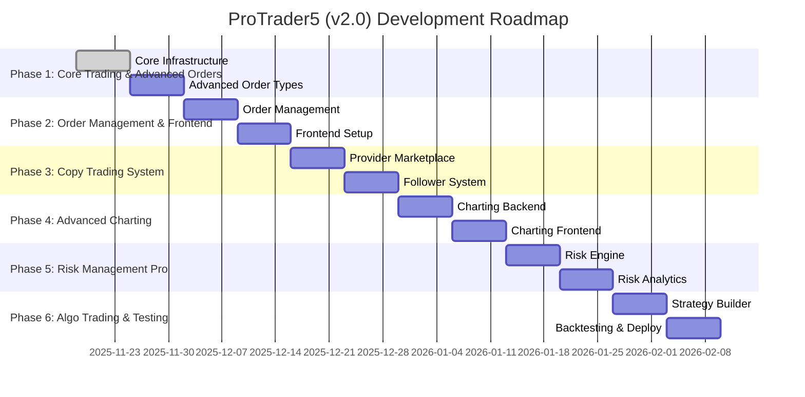

# ProTrader5 (v2.0) - Development Roadmap & Resource Estimation

## 1. Introduction

This document outlines the detailed development roadmap, timeline, and resource estimation for the **ProTrader5 (v2.0)** upgrade. The project is divided into six distinct phases, each with specific deliverables and a two-week timeline.

---

## 2. Development Phases & Timeline

The development will follow an agile methodology with two-week sprints for each phase. The total estimated timeline for the project is **12 weeks**.

### Gantt Chart

### Phase 1: Core Trading & Advanced Orders (Weeks 1-2)

- **Deliverables:**
  - Microservices infrastructure setup (Kubernetes, Docker, API Gateway).
  - **Trading Service** with support for all advanced order types (Trailing Stop, OCO, Iceberg, etc.).
  - **User Service** with enhanced security features (2FA, API keys).
  - Initial data migration from the old system.

### Phase 2: Order Management & Frontend Setup (Weeks 3-4)

- **Deliverables:**
  - Enhanced order management features (partial fills, live modification).
  - **React Web App** initial setup with basic UI components.
  - **React Native Mobile App** initial setup.
  - Integration of the frontend with the User and Trading services.

### Phase 3: Copy Trading System (Weeks 5-6)

- **Deliverables:**
  - **Copy Trading Service** with provider marketplace and follower system.
  - Real-time trade copying and risk-adjusted execution.
  - Frontend interface for managing copy trading subscriptions.

### Phase 4: Advanced Charting (Weeks 7-8)

- **Deliverables:**
  - **Charting Service** with TimescaleDB integration for historical data.
  - Real-time market data pipeline with Kafka.
  - Integration of TradingView Lightweight Charts™ into the frontend.
  - 50+ technical indicators and drawing tools.

### Phase 5: Risk Management Pro (Weeks 9-10)

- **Deliverables:**
  - **Risk Management Service** with advanced risk rules and portfolio analytics.
  - Real-time risk alerts and automated actions.
  - Frontend dashboard for portfolio risk analysis.

### Phase 6: Algorithmic Trading & Testing (Weeks 11-12)

- **Deliverables:**
  - **Algo Trading Service** with visual strategy builder and backtesting engine.
  - Live strategy execution and monitoring.
  - Comprehensive end-to-end testing and bug fixing.
  - Beta launch preparation.

---

## 3. Resource Estimation

The following team structure is recommended for the successful execution of this project.

### Team Structure

- **Project Manager (1):** Responsible for overall project planning, execution, and communication.
- **Lead Architect (1):** Responsible for the overall technical architecture and design.
- **Backend Developers (4):**
  - 2 Senior Backend Developers with experience in Node.js, NestJS, and microservices.
  - 2 Mid-level Backend Developers.
- **Frontend Developers (3):**
  - 1 Senior Frontend Developer with experience in React and React Native.
  - 2 Mid-level Frontend Developers.
- **DevOps Engineer (1):** Responsible for CI/CD, infrastructure, and deployment.
- **QA Engineers (2):** Responsible for manual and automated testing.

### Total Team Size: 12 members

---

## 4. Budget Estimation

The budget estimation provided in the feature specification document is a reasonable starting point. The following is a more detailed breakdown based on the resource plan.

| Category       | Estimated Cost (INR) |
|----------------|----------------------|
| **Development**  | ₹18,00,000 - ₹24,00,000 |
| **Infrastructure** | ₹2,50,000 - ₹4,00,000  |
| **Marketing**    | ₹5,00,000 - ₹10,00,000 |
| **Total (Year 1)** | **₹25,50,000 - ₹38,00,000** |

*Note: Development costs are based on an average monthly salary of ₹1,25,000 - ₹1,67,000 per team member for a 3-month project duration.*

---

## 5. Conclusion

This development roadmap provides a clear path for the successful delivery of the ProTrader5 (v2.0) upgrade. The phased approach allows for iterative development and continuous feedback. The estimated timeline and resources are based on the complexity of the project and the need for a high-quality, scalable, and reliable trading platform.
